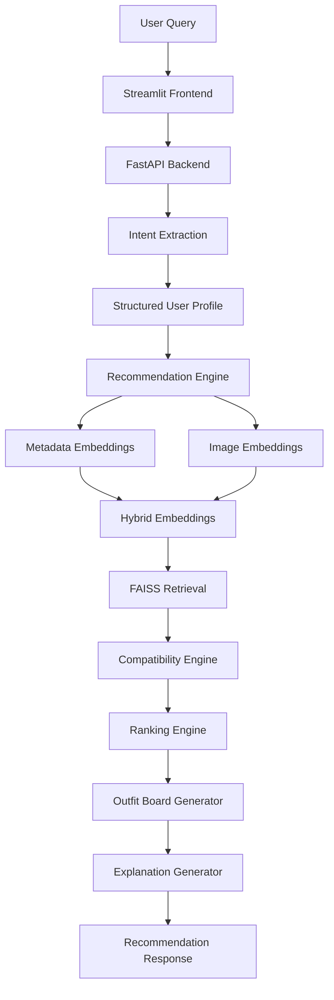

# Fashion AI Outfit Recommendation System

## Dare XAI – Machine Learning & AI Engineer Internship Assignment

An AI-powered Fashion Outfit Recommendation System that understands natural language fashion requests and generates complete outfit recommendations using hybrid retrieval, compatibility scoring, ranking systems, and explainable AI.

The system uses the provided Dare XAI fashion dataset containing product metadata, outfit relationships, and product images from Ajio, Myntra, and Nykaa.

---

# Project Overview

The objective of this project is to build a fashion assistant capable of:

* Understanding natural language fashion requests
* Recommending complete outfits
* Matching compatible fashion items
* Using product metadata and product images
* Providing explainable recommendations
* Displaying actual dataset product images
* Generating outfit boards from retrieved products

Example Queries:

* "I need an outfit for a business meeting."
* "Suggest a smart casual outfit for a dinner date."
* "I am attending a wedding next weekend."
* "I am a 22-year-old male looking for summer clothes."
* "Suggest something stylish for a beach vacation."

---

# Key Features

### Conversational Fashion Assistant

Supports natural language interactions.

Example:

```text
I need a formal outfit for an interview.
```

---

### User-Aware Recommendations

Uses:

* Gender
* Age
* Occasion
* Style Preference
* Season

to personalize recommendations.

---

### Hybrid Recommendation Engine

Combines:

* Metadata embeddings
* Image embeddings
* Compatibility rules
* Occasion matching
* Ranking system

instead of relying solely on LLM prompting.

---

### Outfit Compatibility Engine

Learns outfit relationships from:

```text
outfits.csv
```

Examples:

```text
Formal Shirt
→ Formal Trouser
→ Blazer
→ Formal Shoes
```

```text
Dress
→ Heels
→ Clutch
```

This allows complete outfit recommendations instead of isolated products.

---

### Explainable Recommendations

Every recommendation includes reasoning.

Example:

```text
The navy blazer pairs well with the white formal shirt because the combination creates a professional appearance suitable for business environments.
```

---

### Dataset-Based Product Images

The system uses actual product images from:

* Ajio
* Myntra
* Nykaa

No external or generated fashion products are used.

---

### Outfit Board Generation

The system automatically creates visual outfit boards using Pillow.

Example:

```text
Topwear
Bottomwear
Footwear
Accessory
```

combined into a single recommendation image.

---

# Dataset

Dataset Provided By Dare XAI:

```text
products.csv
outfits.csv
images/
```

---

## products.csv

Contains:

* Product ID
* Product Name
* Brand
* Gender
* Occasion
* Category
* Description
* Product Images

Example:

```text
Arrow Formal Shirt
Category: Formal Shirt
Occasion: Office
Gender: Men
```

---

## outfits.csv

Contains stylist-curated outfit combinations.

Example:

```text
Formal Shirt
Formal Trouser
Blazer
Formal Shoes
```

These combinations are used as compatibility ground truth.

---

## Images

Product images from:

* Ajio
* Myntra
* Nykaa

Used for:

* Image embeddings
* Visual recommendations
* Outfit board generation

---

# System Architecture



---

# Recommendation Pipeline

## Step 1

User enters a natural language query.

Example:

```text
I need an outfit for a wedding.
```

---

## Step 2

Intent Extraction

Extracts:

```json
{
  "occasion":"wedding",
  "gender":"male",
  "style":"formal"
}
```

---

## Step 3

Hybrid Retrieval

Products are retrieved using:

* Metadata similarity
* Image similarity

---

## Step 4

Compatibility Scoring

Uses outfit relationships from:

```text
outfits.csv
```

to identify compatible products.

---

## Step 5

Ranking

Final score:

```text
FinalScore =
0.45 × image_similarity +
0.25 × metadata_similarity +
0.10 × category_match +
0.08 × occasion_match +
0.05 × style_match +
0.04 × color_match +
0.03 × season_match
```

---

## Step 6

Outfit Generation

Selected products are assembled into:

* Topwear
* Bottomwear
* Footwear
* Accessories

---

## Step 7

Explanation Generation

Creates user-friendly reasoning for the recommendation.

---

# Technical Stack

## Backend

* FastAPI

## Frontend

* Streamlit

## Machine Learning

* Scikit-Learn
* Sentence Transformers

## Embeddings

* Metadata Embeddings
* FashionCLIP / CLIP

## Retrieval

* FAISS

## LLM

* Gemini API

## Image Processing

* Pillow

## Deployment

* Docker

## Testing

* Pytest

---

# Project Structure

```text
fashion-ai/

├── app/
├── frontend/
├── data/
├── docs/
├── tests/
├── scripts/
├── cache/
├── requirements.txt
├── Dockerfile
├── docker-compose.yml
└── README.md
```

---

# Running The Project

## Install Dependencies

```bash
pip install -r requirements.txt
```

---

## Start FastAPI

```bash
python -m uvicorn app.api.main:app --reload
```

---

## Start Streamlit

```bash
streamlit run frontend/streamlit_app.py
```

---

# API Endpoints

| Method | Endpoint      | Description                    |
| ------ | ------------- | ------------------------------ |
| GET    | /health       | Health check                   |
| POST   | /chat         | Conversational recommendations |
| POST   | /recommend    | Recommendation endpoint        |
| POST   | /profile      | User profile                   |
| POST   | /similar-item | Similar product retrieval      |
| GET    | /metrics      | System metrics                 |

---

# Testing

Run:

```bash
pytest
```

Current Status:

```text
5 Passed
```

---
## Differentiators & Engineering Decisions

Many fashion recommendation assignments rely primarily on prompting an LLM to generate outfit suggestions.

This project takes a retrieval-first and ranking-first approach.

### 1. Recommendations Are Not Generated By The LLM

The LLM is restricted to:

* Intent extraction
* Conversational interaction
* Explanation generation

Actual recommendations come from:

* Dataset retrieval
* Compatibility scoring
* Ranking logic

This makes the system more explainable, deterministic, and production-friendly.

---

### 2. Uses Actual Outfit Compatibility Data

The provided `outfits.csv` dataset was treated as a compatibility knowledge base.

Instead of recommending products independently, the system learns outfit relationships such as:

Formal Shirt → Formal Trouser → Blazer → Formal Shoes

Dress → Heels → Clutch

This enables complete outfit recommendations.

---

### 3. Hybrid Retrieval

The system combines:

* Product metadata
* Product descriptions
* Fashion attributes
* Product images

to retrieve relevant products.

This is stronger than keyword matching alone.

---

### 4. Explainable Scoring

Recommendations are ranked using explicit scoring:

* Image Similarity
* Metadata Similarity
* Occasion Match
* Style Match
* Category Compatibility
* Color Match
* Season Match

Each recommendation can be explained and audited.

---

### 5. Actual Dataset Images

Recommendations display real product images from:

* Ajio
* Myntra
* Nykaa

No hallucinated or externally generated products are used.

---

### 6. Outfit Board Generation

The system automatically creates outfit boards using retrieved product images.

This provides a visual recommendation experience while remaining grounded in the dataset.

---

### 7. Modular Production Architecture

The project separates:

* Retrieval
* Ranking
* Compatibility
* API
* Frontend
* Intent Extraction

making it easier to scale and maintain.

---

### 8. Engineering Focus Over Prompt Engineering

The solution prioritizes:

* Recommendation Systems
* Information Retrieval
* Ranking Systems
* Explainable AI
* Software Architecture

rather than relying solely on prompt engineering.


# Challenges Faced

* Mapping product catalog data to outfit structures
* Building compatibility relationships
* Combining metadata and image-based retrieval
* Handling image paths across multiple vendors
* Balancing explainability and recommendation quality

---

# Future Improvements

* FashionCLIP fine-tuning
* Graph Neural Networks
* Pairwise Ranking Models
* Reinforcement Learning Based Personalization
* User Feedback Loops
* Large Scale Vector Databases
* Real-Time Online Learning

---

# Why This Approach?

Instead of relying entirely on an LLM:

```text
User Query
↓
LLM
↓
Recommendation
```

This project uses:

```text
User Query
↓
Intent Extraction
↓
Retrieval
↓
Compatibility
↓
Ranking
↓
Explanation
```

This approach is:

* More explainable
* More scalable
* More deterministic
* Easier to evaluate
* Better aligned with real-world recommendation systems

---

# Author

Mandakala Sai Deepika

B.Tech Artificial Intelligence & Data Science

Vignan's Institute of Information Technology

GitHub: [Your GitHub]

LinkedIn: [Your LinkedIn]

```
```
