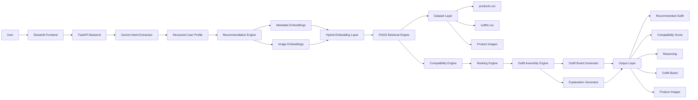

# System Architecture

```mermaid
flowchart LR

A[User]

A --> B[Streamlit Frontend]

B --> C[FastAPI Backend]

C --> D[Gemini Intent Extraction]

D --> E[Structured User Profile]

E --> F[Recommendation Engine]

F --> G[Metadata Embeddings]

F --> H[Image Embeddings]

G --> I[Hybrid Embedding Layer]

H --> I

I --> J[FAISS Retrieval Engine]

J --> K[Dataset Layer]

K --> K1[products.csv]

K --> K2[outfits.csv]

K --> K3[Product Images]

J --> L[Compatibility Engine]

L --> M[Ranking Engine]

M --> N[Outfit Assembly Engine]

N --> O[Outfit Board Generator]

N --> P[Explanation Generator]

O --> Q[Output Layer]

P --> Q

Q --> R[Recommended Outfit]

Q --> S[Compatibility Score]

Q --> T[Reasoning]

Q --> U[Outfit Board]

Q --> V[Product Images]
```